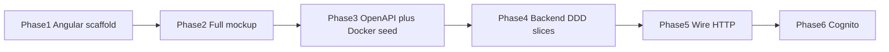
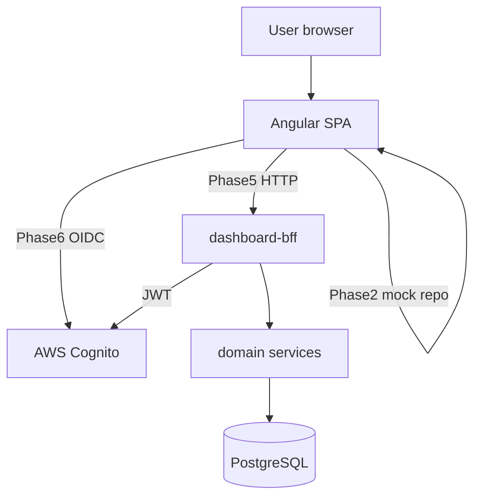

# Architecture (system overview)

**Angular** SPA (full mockup first) · **Multi-module Spring Boot** services (spec-first DDD) · **PostgreSQL** (Docker seed) · **AWS Cognito** (Phase 6) · **OpenAPI + Postman**.

Deep dives:

- [FRONTEND_ARCHITECTURE.md](FRONTEND_ARCHITECTURE.md) — scoped components, shell, ui-kit, mock repositories
- [BACKEND_ARCHITECTURE.md](BACKEND_ARCHITECTURE.md) — **one service module per bounded context** (e.g. `activity-log-service`), BFF, DDD per module
- [adr/0007-modular-backend-services.md](adr/0007-modular-backend-services.md) — why not a single clubbed Spring Boot app

---

## Delivery order (summary)



See [ROADMAP.md](ROADMAP.md) for checklists.

---

## System context (target)



---

## Frontend (high level)

| Area | Role |
|------|------|
| `src/styles/` | Global tokens only |
| `app/shell/` | `FixedNavigationComponent`, `TopBarComponent`, `AppShellComponent` |
| `app/shared/ui/` | `app-button`, `app-modal`, `app-dashboard-card` |
| `app/shared/ui-kit/` | Swappable Material (etc.) adapters |
| `app/features/overview/*/` | One folder per widget; **scoped** SCSS per section |
| `app/data-access/` | `OverviewRepository` — mock then HTTP |

**No** ad-hoc HTML mockup. **No** UI library imports in features.

---

## Backend (high level)

| Artifact | Location |
|----------|----------|
| API contracts | [docs/api/](api/) — **one OpenAPI file per service** |
| Code | `backend/<name>-service/` — full DDD stack inside each module |
| BFF | `backend/dashboard-bff/` — Overview + `/me` for Angular |
| Shared jars | `platform-common`, `platform-security` only |
| Mock DB | `docker/postgres/` — schema per service |
| Manual tests | [docs/api/postman/](api/postman/) — folder per service |

Example: Activity Log → **only** `activity-log-service`, not a package inside a monolith.

---

## Module map (domain ↔ UI)

| UI section (scoped component) | OpenAPI / context |
|------------------------------|-------------------|
| `total-budgets/` | `TotalBudgetsSection` / Budget |
| `spending-this-month/` | `SpendingSection` / Spending |
| `goals-widget/` | Goals |
| `transactions-widget/` | Ledger |
| `investments-widget/` | Portfolio |
| `recurring-widget/` | Recurring |

---

## Authorization (Phase 6+)

| Concern | Implementation |
|---------|----------------|
| UI routes | `authGuard` |
| API | OAuth2 Resource Server + Cognito JWKS |
| Data | `user_sub` = JWT `sub` |
| Local dev (pre-Cognito) | `X-Dev-User-Sub` per [seed-users.md](api/seed-users.md) |

---

## Repository layout

```
finance-platform/
├── frontend/
├── backend/                  # Maven parent + *-service modules + dashboard-bff
├── docs/api/                 # dashboard.openapi.yaml, activity-log.openapi.yaml, …
├── docker/
├── docker-compose.yml        # Postgres + optional service profiles
└── dashboard.webp
```

---

## Related

- [ROADMAP.md](ROADMAP.md)
- [adr/0005-ui-kit-abstraction.md](adr/0005-ui-kit-abstraction.md)
- [adr/0007-modular-backend-services.md](adr/0007-modular-backend-services.md)
- [adr/0006-spec-first-ddd-backend.md](adr/0006-spec-first-ddd-backend.md)
- [adr/0004-auth-cognito.md](adr/0004-auth-cognito.md)
