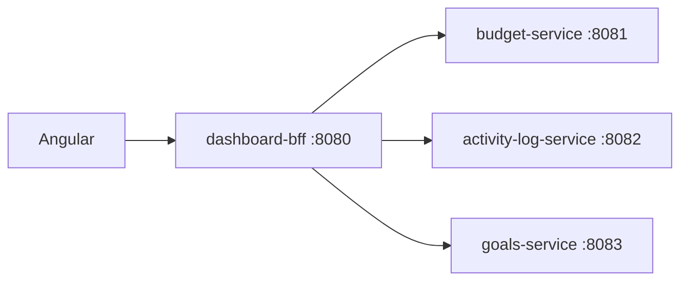

# Backend architecture (multi-module DDD + spec-first)

**Maven multi-module monorepo** — each bounded context is its own **Spring Boot service module**, not one clubbed application. See [adr/0007-modular-backend-services.md](adr/0007-modular-backend-services.md).

Shared: **OpenAPI-first**, **Docker seed**, **Postman**, **Cognito JWT** (Phase 6).

---

## Principles

| Principle | Rule |
|-----------|------|
| **One context = one service module** | e.g. Activity Log only in `activity-log-service` |
| **Spec before code** | Per-service OpenAPI under `docs/api/` before controllers |
| **Incremental delivery** | Add a new `*-service` module when that nav/feature starts |
| **DDD inside each module** | `domain` → `application` → `infrastructure` → `web` per service |
| **No cross-domain imports** | Service A does not depend on Service B’s `domain` package |
| **BFF for UI** | `dashboard-bff` composes Overview; Angular talks primarily to BFF |
| **Postman** | Folder per service + merged collection |

---

## Repository layout

```
backend/
├── pom.xml                          # platform-parent (packaging pom)
├── platform-common/                 # jar: Money, UserId, ErrorEnvelope, util
├── platform-security/               # jar: JWT resource-server autoconfig (Cognito)
├── dashboard-bff/                   # Spring Boot :8080 — Overview, /me, health
├── budget-service/                  # Spring Boot :8081 — budgets, spending plan
├── activity-log-service/            # Spring Boot :8082 — activity log only
├── goals-service/                   # :8083
├── ledger-service/                  # :8084 — transactions
├── portfolio-service/               # :8085
├── recurring-service/               # :8086
└── (future) insights-service/       # when needed
```

### When to add a module

| Trigger | Action |
|---------|--------|
| New sidebar area with its own persistence rules | New `*-service` + schema + `docs/api/<name>.openapi.yaml` |
| Overview needs data from a context | BFF calls that service’s API (or cached read model) |
| Shared value object (Money, UserId) | Add to `platform-common` only — no aggregates |

---

## Per-service DDD structure

Example: **`activity-log-service`** (Activity Log — isolated from budget/ledger).

```
activity-log-service/src/main/java/com/finance/platform/activitylog/
├── domain/
│   ├── ActivityEntry.java           # aggregate
│   └── ActivityLogRepository.java   # port
├── application/
│   ├── ListActivityQuery.java
│   └── ListActivityQueryHandler.java
├── infrastructure/
│   └── persistence/
│       ├── ActivityEntryJpaEntity.java
│       └── ActivityLogRepositoryAdapter.java
└── web/
    └── ActivityLogController.java
```

`budget-service` has the same layer names under `.../budget/` — **no shared `domain/budget` folder at repo root**.

### Layer rules (unchanged, per module)

| Layer | May depend on | Must not |
|-------|---------------|----------|
| `domain` | domain, `platform-common` types | Spring, JPA, other services |
| `application` | domain, common | JPA entities, HTTP |
| `infrastructure` | domain, application ports | Controllers |
| `web` | application, dto | Other services’ repositories |

---

## dashboard-bff (edge for Angular)

| Responsibility | Owns |
|----------------|------|
| `GET /api/v1/health` | yes |
| `GET /api/v1/me` | yes (identity from JWT) |
| `GET /api/v1/dashboard/overview` | composes responses from other services |
| CRUD for goals, budgets, … | **no** — delegate to domain services |



BFF uses **WebClient** (or RestClient) with service discovery via config:

```yaml
platform:
  services:
    budget: http://localhost:8081
    activity-log: http://localhost:8082
```

---

## Bounded contexts ↔ modules

| DESIGN nav | Service module | Notes |
|------------|----------------|-------|
| Overview (widgets) | `dashboard-bff` | Composer only |
| Spending Plan / budgets | `budget-service` | |
| **Activity Log** | **`activity-log-service`** | **Separate deployable** |
| Money Movement / transactions | `ledger-service` | Distinct from activity log if audit vs ledger differ |
| Savings Goals | `goals-service` | |
| Portfolio | `portfolio-service` | |
| Subscriptions | `recurring-service` | |
| Wallets & Banks | `wallet-service` (future) | |
| Insights | `insights-service` (future) | |

If Activity Log and Transactions share storage early, still **split modules**; share nothing except `platform-common` until you define an explicit integration ADR.

---

## OpenAPI & Postman (per service)

| Artifact | Location |
|----------|----------|
| BFF spec | `docs/api/dashboard.openapi.yaml` |
| Activity Log spec | `docs/api/activity-log.openapi.yaml` |
| Budget spec | `docs/api/budget.openapi.yaml` |
| Merged (optional) | `docs/api/openapi.yaml` — aggregate for CI / single Postman import |
| Postman | `docs/api/postman/` — one collection, **folder per service** |

Workflow unchanged: **spec PR → implement in that service module only → regenerate Postman**.

---

## Database (Docker)

**Default (dev):** one Postgres, **schema per service**:

| Schema | Service |
|--------|---------|
| `bff` | BFF projections if any |
| `budget` | budget-service Flyway |
| `activity_log` | activity-log-service Flyway |
| `goals` | goals-service Flyway |
| … | … |

Each service’s `application.yml`:

```yaml
spring:
  datasource:
    url: jdbc:postgresql://localhost:5432/finance_dashboard?currentSchema=activity_log
  flyway:
    schemas: activity_log
```

Alternative (later ADR): database per service — more isolation, more containers.

---

## Spec-first workflow (per module)

1. Edit the **service’s** OpenAPI file.
2. Implement inside **that** `*-service` module only.
3. If BFF exposes the route, update BFF spec to document aggregation and add WebClient call.
4. Run tests: `./mvnw -pl activity-log-service test`
5. Run full stack: `docker compose --profile full up`

---

## Auth (all services)

- Each Spring Boot app includes `platform-security` (Cognito JWT).
- Same issuer; each service validates JWT independently.
- Postman: same `bearerToken` / `X-Dev-User-Sub` for every service port in dev.

---

## Testing

| Level | Where |
|-------|--------|
| Domain/application unit | Inside each `*-service` |
| API slice | `@WebMvcTest` per service |
| BFF contract | MockWebServer for downstream services |
| Integration | Testcontainers + schema-specific Flyway per module |
| Manual | Postman folder per running service |

---

## Phase 4 scaffold order (see ROADMAP)

1. `platform-parent` + `platform-common` + `platform-security`
2. `dashboard-bff` — health, me, stub overview
3. `budget-service` — first domain vertical
4. `activity-log-service` — when Activity Log UI starts (Phase 7)
5. Additional services as nav pages ship

---

## Extensibility

- Extract module to own repo: move `activity-log-service/` with its pom parent reference — minimal coupling.
- Replace HTTP with events: new ADR; modules stay separate.
- New UI library unrelated — frontend only.

---

## Related

- [adr/0007-modular-backend-services.md](adr/0007-modular-backend-services.md)
- [adr/0006-spec-first-ddd-backend.md](adr/0006-spec-first-ddd-backend.md)
- [adr/0003-backend-and-data.md](adr/0003-backend-and-data.md)
- [api/README.md](api/README.md)
