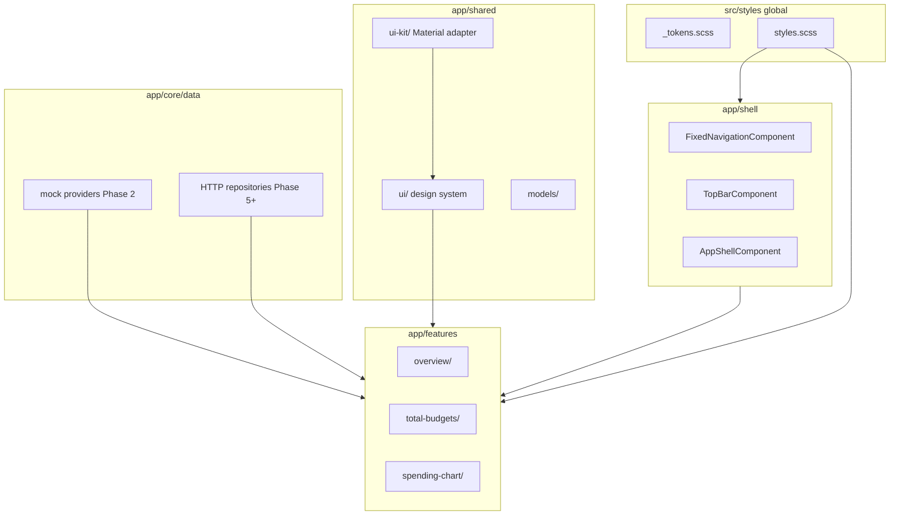

# Frontend architecture (Angular)

Production-grade structure for the full dashboard mockup and future API integration. Visual source: [DESIGN.md](DESIGN.md) and [dashboard.webp](../dashboard.webp).

---

## Principles

| Principle | Rule |
|-----------|------|
| **No ad-hoc mockup HTML** | Every screen element is a component with its own `.html` / `.scss` / `.ts` — no one-off markup in `app.component.html` to “fake” the UI |
| **Scoped styles** | Feature/section styles live in that component’s SCSS with `:host` and a **single root class** (e.g. `.total-budgets`) — no leaking selectors |
| **Global styles only at root** | Tokens, reset, typography, and layout utilities in `src/styles/` only |
| **Swappable UI library** | Feature code never imports Angular Material (or PrimeNG) directly — only `shared/ui-kit` adapters |
| **Fixed shell components** | Navigation, top bar, and app shell are **separate, stable** components under `shell/` |
| **Consistent modals** | All dialogs use `AppModalComponent` + `ModalService` — same header, body, footer, and button slots |

---

## Layer diagram



---

## Directory layout

```
frontend/src/
├── styles/                          # ROOT ONLY — global CSS
│   ├── _tokens.scss                 # from docs/design-tokens.json
│   ├── _typography.scss
│   ├── _reset.scss
│   └── styles.scss                  # imported in angular.json
├── app/
│   ├── core/                        # singletons: auth, interceptors, guards
│   ├── shell/                       # fixed layout — do not mix feature SCSS here
│   │   ├── app-shell/
│   │   ├── fixed-navigation/        # sidebar: logo, nav items, promo, profile
│   │   └── top-bar/                 # search, customize
│   ├── shared/
│   │   ├── ui/                      # design system (library-agnostic)
│   │   │   ├── button/              # app-button — fixed API
│   │   │   ├── modal/               # app-modal — ONLY way to show dialogs
│   │   │   ├── card/                # dashboard-card
│   │   │   ├── pill/
│   │   │   └── icon/
│   │   ├── ui-kit/                  # swappable implementation
│   │   │   ├── ui-kit.ts            # tokens: UI_KIT, UiKitModule
│   │   │   └── material/            # MaterialMatButtonAdapter, MaterialDialogModalAdapter
│   │   └── models/                  # TypeScript interfaces (OverviewDto, etc.)
│   ├── features/
│   │   └── overview/
│   │       ├── overview.page.ts     # smart container — wires facade only
│   │       ├── overview.routes.ts
│   │       ├── total-budgets/       # scoped section
│   │       ├── spending-this-month/
│   │       ├── goals-widget/
│   │       ├── transactions-widget/
│   │       ├── investments-widget/
│   │       └── recurring-widget/
│   └── data-access/                 # repositories + mock/real swap
│       ├── overview/
│       │   ├── overview.repository.ts      # interface
│       │   ├── overview-mock.repository.ts
│       │   └── overview-http.repository.ts
│       └── providers.ts               # environment: useMockData flag
```

---

## Scoped CSS pattern

Each section component **must** use one block class on `:host` or root element:

```scss
// total-budgets.component.scss
:host {
  display: block;
}

.total-budgets {
  // all section rules nested here — never bare `h2`, `div` at file root
  &__header { }
  &__allocation-bar { }
  &__category-row { }
}
```

```html
<!-- total-budgets.component.html -->
<section class="total-budgets">
  <app-dashboard-card>...</app-dashboard-card>
</section>
```

**Forbidden:** global classes like `.budget-title` in `styles.scss` for feature-specific layout. **Forbidden:** `ViewEncapsulation.None` on feature components unless documented in an ADR.

---

## UI kit abstraction (switch library later)

```typescript
// shared/ui-kit/ui-kit.ts
export interface UiKitButtonConfig {
  label: string;
  variant: 'primary' | 'secondary' | 'text';
  disabled?: boolean;
}

export abstract class UiKitModalAdapter {
  abstract open(config: ModalConfig): Observable<ModalResult>;
}
```

- Features inject `UiKitModalAdapter` / use `<app-button>` which delegates to Material today.
- To switch to PrimeNG: add `shared/ui-kit/prime/` and change one `UiKitModule` import in `app.config.ts`.
- ADR: [0005-ui-kit-abstraction.md](adr/0005-ui-kit-abstraction.md)

---

## Modal standard (all features)

| Element | Component / API |
|---------|-----------------|
| Shell | `AppModalComponent` — fixed width, padding, elevation |
| Open | `ModalService.open(ModalConfig)` |
| Primary action | `<app-button variant="primary">` in footer slot |
| Secondary | `<app-button variant="text">` cancel |
| Content | Projected `ng-content` or template ref — **no** raw Material dialog in features |

Every modal looks identical (title bar, divider, footer button order: cancel left, primary right).

---

## Mockup phase data (no API)

- Mock data lives in `*.mock.ts` next to repository or under `data-access/mocks/`.
- `OverviewFacade` exposes `overview$` from `OverviewRepository` (mock implementation).
- Page components bind via `async` pipe — same pattern as production HTTP.

```typescript
// overview.page.ts — no inline arrays in template
readonly overview$ = this.facade.overview$;
```

---

## Shell components (fixed navigation)

| Component | Responsibility |
|-----------|----------------|
| `FixedNavigationComponent` | Sidebar only: logo, `navItems` input, promo slot, profile footer |
| `TopBarComponent` | Search + Customize |
| `AppShellComponent` | Grid: nav + main; `<router-outlet>` in main |

Overview feature **does not** render sidebar markup — only widget sections.

---

## Routing

- Lazy `features/overview/overview.routes.ts`
- Shell wraps all authenticated routes via parent route `AppShellComponent`
- Stub routes for other nav items reuse `PlaceholderPageComponent` from `shared/ui`

---

## Testing

- **Every** section component: `TestBed` + snapshot or DOM assertions for scoped class root
- Modal: test `ModalService` opens `AppModalComponent` with config
- No tests that depend on Material internals — mock `UiKitModule`

---

## Related

- [ROADMAP.md](ROADMAP.md) — Phase 1–2 deliverables
- [CONVENTIONS.md](CONVENTIONS.md) — naming and don’ts
- [DESIGN.md](DESIGN.md) — widget inventory
